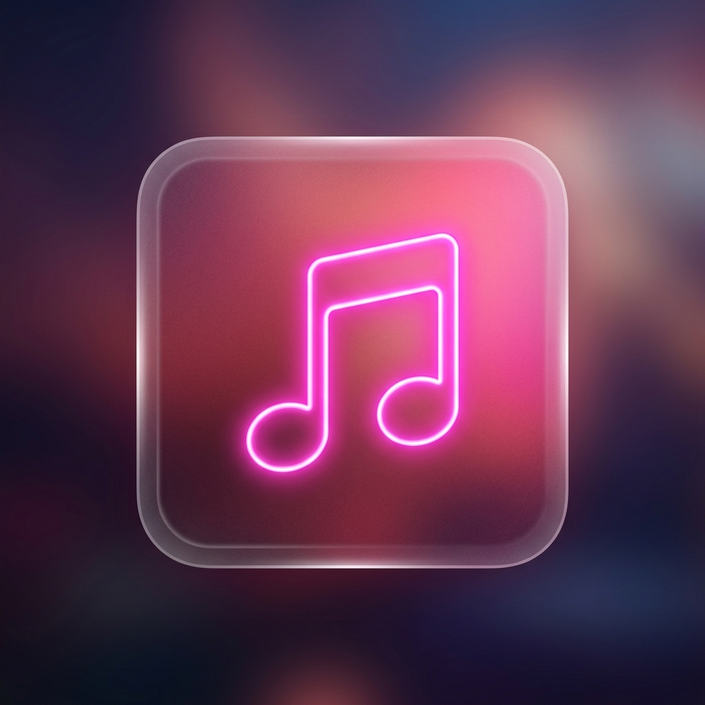

# MiniLyric 🎵

A sleek, modern, minimal desktop lyrics widget for Windows. 
MiniLyric stays on top of your windows, providing beautifully synchronized, glassmorphism-styled lyrics for whatever music you're playing globally on Windows 10/11.



## ✨ Features
- **Universal Music Support**: Works instantly with Spotify, YouTube Music (via modern browsers), Apple Music, VLC, and the new Windows 11 Media Player using modern Windows SMTC.
- **Synchronized Lyrics**: Automatically fetches real-time synced lyrics from LRCLIB.
- **Romaji Conversion**: Automatically translates and spaces Japanese Kanji/Kana to Romaji using Kuroshiro for easy reading.
- **Frictionless UI**: A stunning pink glassmorphism aesthetic that can be "locked" to become completely transparent and click-through, ensuring it never interrupts your workflow.
- **Smart Tracking**: Never jumps around or stutters! Smoothly tracks music progress even during pauses or skips.

## 🚀 Getting Started

### Prerequisites
- Node.js 18+
- Windows 10 or 11 (Requires System Media Transport Controls)

### Installation
1. Clone the repository.
2. Run `npm install` to install dependencies.
3. Run `npm run dev` to start the app in development mode.

### Building for Production
To build a `.exe` installer for Windows:
```bash
npm run build
```
The installer will be generated inside the `release/` folder.

## 🎨 How to Use
- **Start Music**: Simply play any music on a supported modern media player.
- **Move Window**: Click and drag any empty space in the widget to move it around.
- **Lock Window**: Click the Lock icon in the top right to make the widget click-through. The controls will disappear.
- **Unlock Window**: Hover your mouse over the very top-right corner of the lyrics widget, and the unlock button will gracefully appear.

## 🛠 Tech Stack
- Electron & Vite
- React 19 & Tailwind CSS 4
- Framer Motion (for smooth lyric animations)
- Kuroshiro (for Romaji processing)
- windows-media-sessions (for SMTC tracking)

## 📝 Note on Classic Windows Media Player
Please note that the classic "Windows Media Player" (WMP 12 from Windows 7 era) is **not supported**, as it does not broadcast metadata to the modern Windows SMTC system. Please use modern alternatives for local files.
